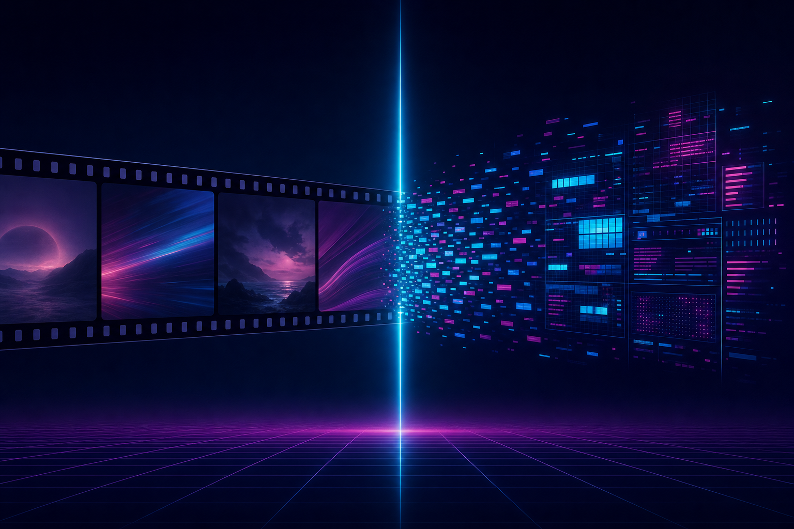
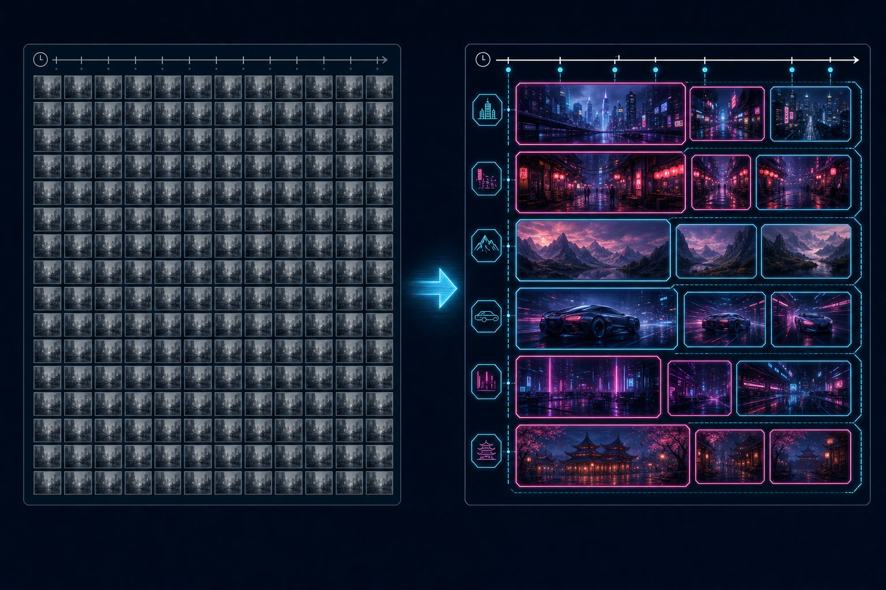

<div align="center">



# cc-video

**Deep video understanding for Claude Code.**
Shot-aware. Cross-modal. Beyond uniform frame sampling.

[](https://www.python.org/downloads/)
[](LICENSE)
[](#)

</div>

---

## What it does

```
video → shots → keyframes/shot → ASR + diarization → OCR → VLM caption/shot
      → cross-modal merger → video.understanding.md  (Claude reads this)
```

Instead of grabbing frames at a fixed interval and shoveling raw JPEGs into
the model, `cc-video` runs a structured multimodal pipeline once, persists a
compact text timeline, and lets Claude work from that on every follow-up
question.

---

## Why structure beats uniform sampling

<div align="center">

</div>

Uniform sampling treats a 30-second static IDE shot the same as a 1-second
hard cut — wasted frames where nothing changes, missed frames where
everything does.

`cc-video` segments the video first, then samples per shot.

| | Uniform sampling | cc-video |
|---|---|---|
| **Frame budget** | Fixed fps, hard cap | 1–5 per shot, no cap |
| **Transcript** | Plain segments | Word-level + speaker diarization |
| **On-screen text** | Re-OCR'd visually each query | PaddleOCR per keyframe → deduped per shot |
| **Visual description** | Raw frames burned into context | Pre-captioned per shot by Gemini |
| **Long videos** | "Sparse scan" warning past 10 min | Full coverage regardless of length |
| **Re-query cost** | Re-runs everything | `cc-video query` greps cached JSON |

---

## Quick start

```bash
# install — Python 3.10+
pip install -e .                  # core: ffmpeg + yt-dlp + scenedetect
pip install -e '.[asr]'           # + faster-whisper + pyannote (local transcript)
pip install -e '.[ocr]'           # + PaddleOCR
pip install -e '.[vlm]'           # + google-genai for shot captions
pip install -e '.[all]'           # everything

# binaries (one-time)
brew install ffmpeg yt-dlp                       # macOS
sudo apt install ffmpeg && pipx install yt-dlp   # Linux
winget install ffmpeg && pip install yt-dlp      # Windows

# run
cc-video analyze sample.mp4
cc-video analyze https://youtu.be/abc

# resume an interrupted run (everything completed so far is reused)
cc-video analyze --resume ./out/<video-id>-<timestamp>

# query the cached analysis (no re-run)
cc-video query ./out/<video-id>-<timestamp> "what tool was used to deploy"
```

Output lands in a per-video timestamped folder:

```
out/<video-id>-<YYMMDD-HHMMSS>/
├── video.understanding.md      # Claude reads this — full timeline + transcript
├── video.understanding.json    # programmatic access
├── keyframes/                  # only the selected frames
│   ├── shot0000_cluster-0.jpg
│   ├── shot0001_cluster-1.jpg
│   └── …
├── audio.wav                   # if ASR ran
├── download/                   # the source video + info.json
└── state/                      # per-stage checkpoints — auto-resume
    ├── shots.json
    ├── keyframes.json
    ├── transcript.json
    ├── ocr.jsonl               # appended per frame as OCR completes
    └── vlm.jsonl               # appended per shot as captions return
```

Every stage writes to `state/` as it completes. Re-running with `--resume`
picks up exactly where it left off — interrupted OCR resumes per-frame,
interrupted VLM resumes per-shot. No redo, no rate-limit re-burn.

---

## Pipeline detail

| Step | Module | What it does |
|---|---|---|
| 1 | `probe.py`   | `ffprobe` for duration, resolution, audio presence |
| 2 | `download.py`| `yt-dlp` for URLs (subtitles optional); local files pass through |
| 3 | `shots.py`   | PySceneDetect `AdaptiveDetector` with rolling-average threshold robust to camera motion. Micro-shots <0.6s merged into neighbors |
| 4 | `keyframes.py` | Middle frame per shot by default; shots >8s get start+middle+end. `--deep-keyframes` runs CLIP embeddings + k-means inside each shot for diverse representatives |
| 5 | `transcript.py` | Three-way fallback: Groq Whisper API → faster-whisper local → OpenAI Whisper API. Word timestamps included. Audio auto-compressed if API size limit hit |
| 5b | `transcript.py` (cont.) | Pyannote speaker diarization layered onto whichever transcript backend ran (decoupled — works with API or local) |
| 6 | `ocr.py`     | PaddleOCR per keyframe, deduped per shot. Language auto-detected from transcript (Vietnamese diacritics → `lang=vi`, else fallback) |
| 7 | `vlm.py`     | Gemini 2.5 reads (keyframes + transcript-in-shot + OCR-in-shot) and returns structured JSON: `action`, `setting`, `on_screen_text_summary`, `notable_objects`, `change_from_prev`. Retries with backoff on 429/503 |
| 8 | `merger.py`  | Slice transcript by shot boundaries; group consecutive similar shots into chapters via setting-token Jaccard similarity |
| 9 | `output.py`  | Render Markdown timeline + JSON |

---

## Configuration

All environment variables are optional. The pipeline degrades gracefully —
missing key just disables the stage it powers.

| Var | Purpose |
|---|---|
| `GEMINI_API_KEY` (or `GOOGLE_API_KEY`) | Per-shot VLM captioning. Free tier 250 req/day; paid Tier 1 is 10K req/day at ~$0.10/video |
| `GROQ_API_KEY` | Whisper API — fast, free, preferred when set |
| `OPENAI_API_KEY` | Whisper API fallback |
| `HF_TOKEN` | Pyannote speaker diarization. Requires accepting license for `pyannote/speaker-diarization-3.1` AND `pyannote/segmentation-3.0` on HuggingFace |

### CLI flags

```bash
cc-video analyze <source>
  --out-dir ./out             # parent dir (default ./out). Outputs go to ./out/<slug>-<timestamp>/
  --no-deep-keyframes         # disable CLIP clustering (deep keyframes are on by default)
  --no-vlm                    # skip Gemini per-shot captioning
  --no-ocr                    # skip PaddleOCR
  --no-asr                    # skip transcription entirely
  --whisper-model large-v3    # tiny|base|small|medium|large-v3 (for local Whisper path)
  --vlm-model gemini-2.5-flash  # or gemini-2.5-pro for higher quality, lower quota
  --resolution 1080           # keyframe width in px (default 1080)
```

---

## Use as a Claude Code skill

```bash
git clone https://github.com/tvtdev94/cc-video.git ~/.claude/skills/cc-video
pip install -e ~/.claude/skills/cc-video[all]
```

Then in Claude Code:

```
/cc-video https://youtu.be/abc what stack did they use?
/cc-video screen-recording.mp4 where does the error appear?
```

The skill (`SKILL.md`) tells Claude to run `cc-video analyze`, then `Read`
the resulting `video.understanding.md`. Individual keyframe JPEGs are
opened only when the question needs detail past the per-shot captions.

---

## License

MIT.
